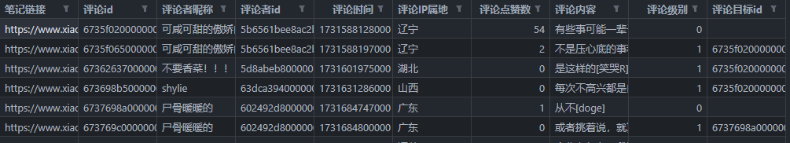
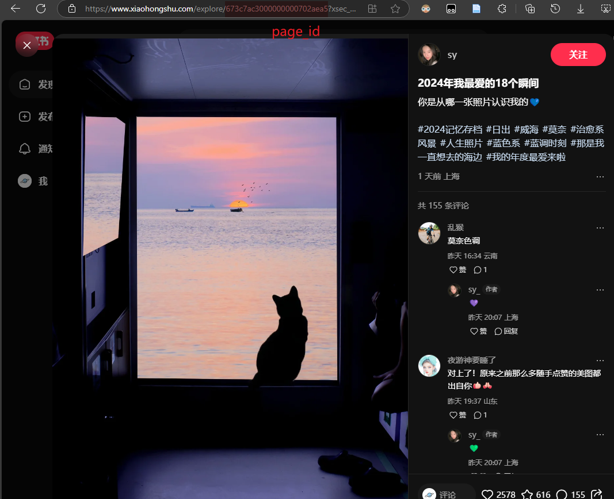
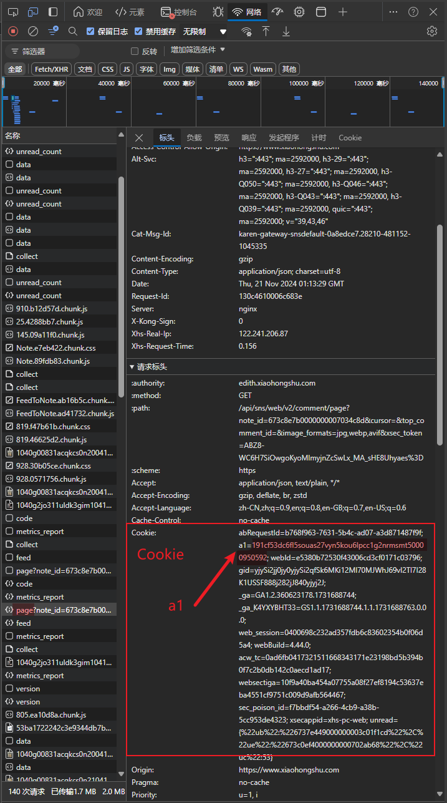

# 小红书评论抓取爬虫

> Update_date: 2024.11.16

## 效果展示



## 文件结构

- `main.py`：程序主入口
- `xs_encrypt.py`：小红书加密参数`h1.x-s`生成，来源于[Cloxl/xhshow](https://github.com/Cloxl/xhshow/blob/master/encrypt/xs_encrypt.py)

## 运行

修改参数

- `page_id`：文章id
- `h1.Cookie`：登录用户的Cookie
- `h1.a1`：用于生成加密参数，从Cookie中获取



按`F12`打开`浏览器开发者工具`，将标签切换至`网络`后，打开任一帖子，寻找`page`请求，从中摘出`h1.Cookie`与`h1.a1`



运行

```bash
python main.py
```

